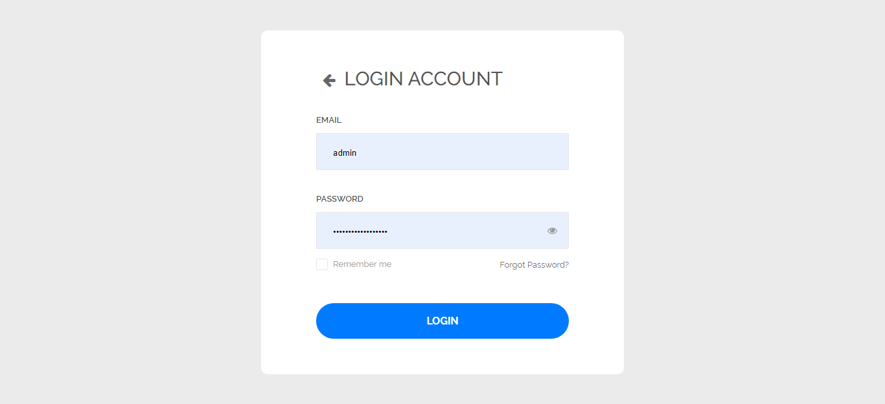
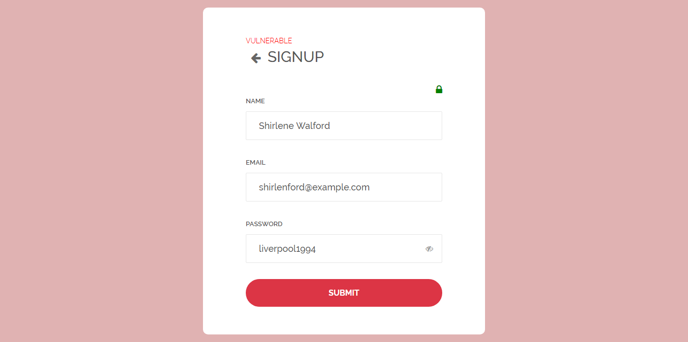
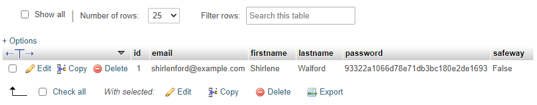
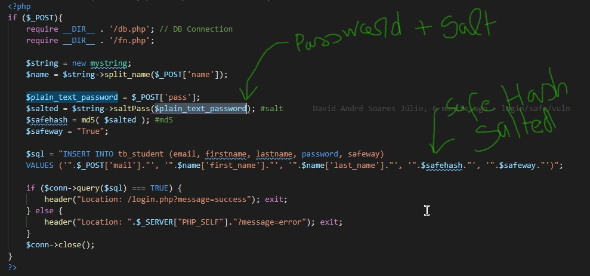
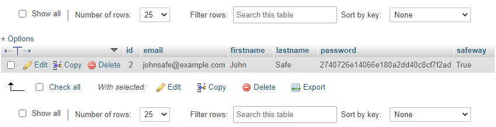
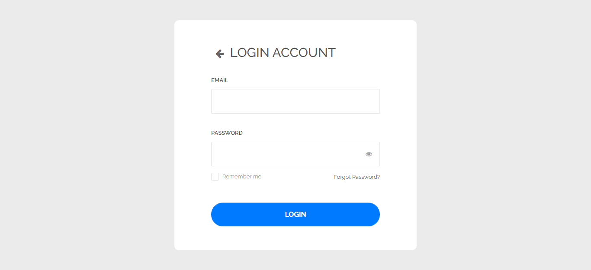
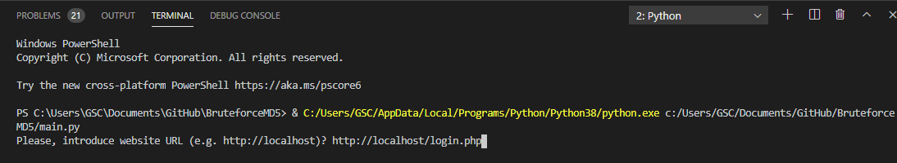
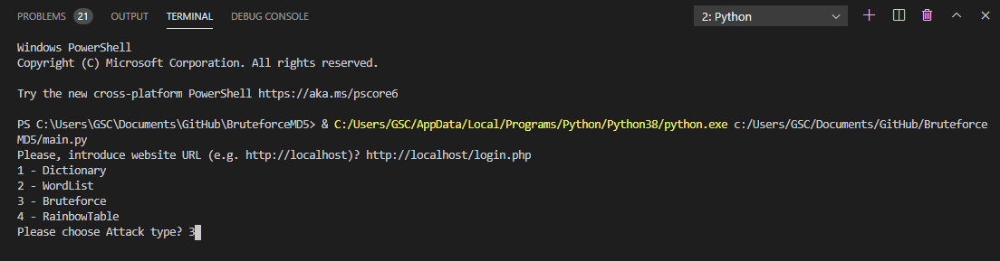
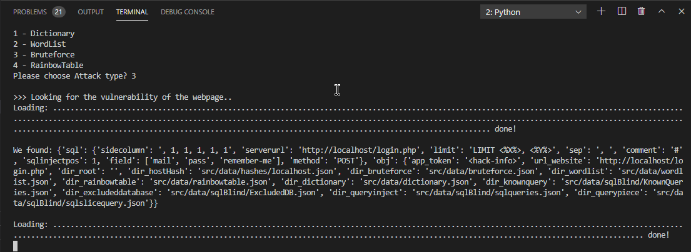

# MD5 Brute Force

Python 3.8.2

Programming and Security

 

Please install:

### - install python v3.8.2
### - install pip
### - pip install bs4
### - pip install requests
### - install Xampp (SERVER)
### - XAMPP: change the path from xampp to ../BruteforceMD5/src/www
 
<code>
  
Example: 

  
 Please write the web page with an input? http://localhost/login.php

  </img>
    
  
[+] Threads: 24

  
[+] Try: 27284127

  
[+] Found: 10

  
[+] Finished in 184.72 second(s)

  
[+] File: C:../../src/data/hash.json

</code>

Some developers, when creating a login system using MD5, do not do it in a secure way, the password entered by the application user is the same password that goes into the database. as shown in the figure below

 
# Front End
</img>
  
# Back End
</img>
 
</img>
 
 
<code>
  md5('liverpool1994') == '93322a1066d78e71db3bc180e2de1693'
</code>
 
 
</img>
 

The bad news is that this form of encryption can be easily broken, with some technical help:

### - [BruteForce Attack](https://en.wikipedia.org/wiki/Brute-force_attack)

### - [Dictionary Attack](https://en.wikipedia.org/wiki/Dictionary_attack)

### - [RainbowTable Attack](https://en.wikipedia.org/wiki/Rainbow_table)

### - [WordList Attack](https://securityonline.info/collection-great-wordlist-for-brute-force-attackwordlist-brute-force-attackword-list-downloads/)

 
Don't worry, there is a solution for this type of problem.
 

# Front End
</img>
  
# Back End
</img>
 
</img>
  
<code>
  md5('anyPassword05') != '2740726e14066e180a2dd40c8cf7f2ad'
</code>
  

# How this algorithm works?

### 1st - You need to add the web page with input. 
</img>
  
### 2nd - Copy the URL http://localhost/login.php  
### Add URL
  
### Add type
  
### Wait for the result
</img>